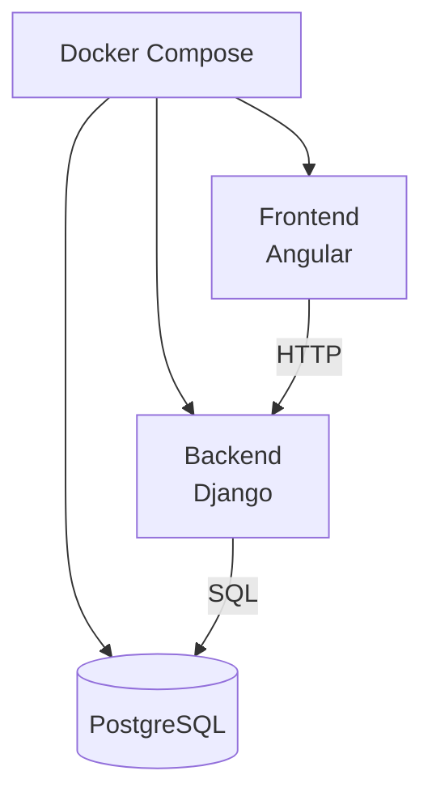
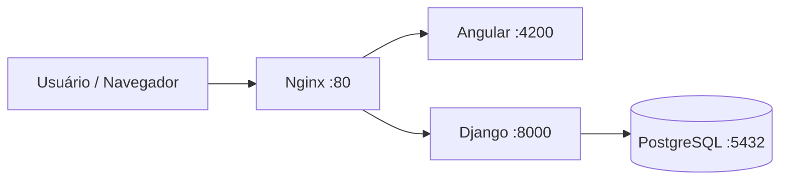

# Task Manager

Aplicação web para gerenciamento de projetos e tarefas.

O sistema permite criar projetos e associar várias tarefas a cada projeto. Projetos e tarefas possuem descrição e podem ser editados ou excluídos. As tarefas também podem ser marcadas como pendentes ou concluídas.

## Funcionalidades

* Criar, editar e excluir projetos
* Criar, editar e excluir tarefas
* Associar tarefas a projetos
* Marcar tarefas como pendentes ou concluídas
* Filtrar tarefas de acordo com o projeto
* Interface web para gerenciamento das informações

## Tecnologias

* **Frontend:** Angular
* **Backend:** Django + Django REST Framework
* **Banco de dados:** PostgreSQL
* **Containerização:** Docker + Docker Compose
* **Servidor:** Ubuntu
* **Reverse Proxy:** Nginx
* **Cloud:** Oracle Cloud Infrastructure (OCI)

## Deploy

A aplicação está atualmente hospedada em uma VM Ubuntu na Oracle Cloud Infrastructure.

**Acesse:** http://129.213.110.12/

A estrutura do deploy utiliza Docker Compose para executar o frontend, backend e banco de dados. O Nginx recebe as requisições externas e encaminha cada uma para o serviço correspondente.


## Arquitetura



## API

O backend disponibiliza uma API REST para projetos e tarefas.

### Projetos

```text
GET     /api/projects/
POST    /api/projects/
PATCH   /api/projects/<id>/
DELETE  /api/projects/<id>/
```

### Tarefas

```text
GET     /api/tasks/
POST    /api/tasks/
PATCH   /api/tasks/<id>/
DELETE  /api/tasks/<id>/
```

As tarefas também podem ser filtradas de acordo com o projeto ao qual estão associadas.

## Rodando localmente

### Requisitos

* Docker
* Docker Compose
* Git

Clone o repositório:

```bash
git clone <URL_DO_REPOSITORIO>
cd task-manager
```

Crie um arquivo `.env` na raiz do projeto:

```env
POSTGRES_DB=taskmanager
POSTGRES_USER=taskmanager
POSTGRES_PASSWORD=sua_senha
```

Suba os containers:

```bash
docker compose up -d --build
```

A aplicação estará disponível em:

```text
Frontend: http://localhost:4200
Backend:  http://localhost:8000
```

Para parar os containers:

```bash
docker compose down
```

## Estrutura

```text
task-manager/
├── backend/
│   ├── manage.py
│   ├── projects/
│   └── ...
├── frontend/
│   ├── src/
│   ├── Dockerfile
│   └── ...
├── docker-compose.yml
├── .env
└── README.md
```

## Docker

O projeto utiliza três containers principais:

* **frontend:** aplicação Angular
* **backend:** API Django
* **db:** PostgreSQL

O Docker Compose cria uma rede interna entre os serviços, permitindo que o backend acesse o banco através do hostname `db`.

## Nginx

No ambiente de produção, o Nginx atua como reverse proxy.

As requisições para a aplicação são direcionadas para o frontend, enquanto as requisições iniciadas por `/api/` são encaminhadas para o backend Django.

Isso permite acessar a aplicação através de uma única porta:

```text
http://129.213.110.12/
```

em vez de acessar diretamente as portas dos containers.
